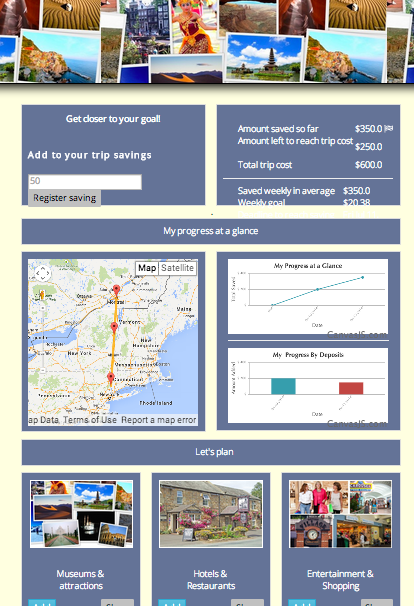

GetReadySaveGo
==============
WDI Final Project

Exciting app to organize, anticipate, save and track your next trip.
This apps gives the user visual representation of their progress in preparing for their trip. A middle marker on the map moves according to the percentage of the trip saved.
 A graph shows how much has been saved and when. The user can save some pictures, links and comments about the trip and plan at his or her own pace. After his trip, he can go back to them and add other comments and pictures. 

## This app lives at: http://getreadysavego.herokuapp.com

## Powered by:  
* Ruby (2.0) on Rails (4) 
* PostgreSQL 
* Google Api 
* Canvas.js 
* Bootstrap